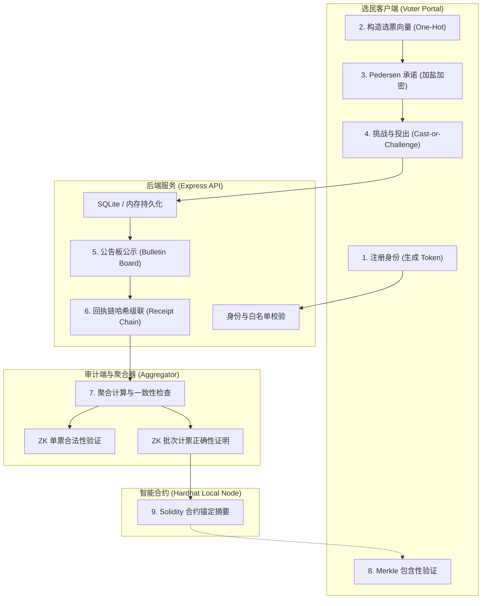

# VeriVote

VeriVote 是一个面向高校、社团、企业内部等低信任场景设计的**隐私保护与可验证电子投票平台**。项目侧重于公开可验证性（Public Verifiability）、聚合审计、链上存证以及 ZK-SNARKs 证明的工程实现。

---

## 1. 深度系统架构与工作流

VeriVote 采用 monorepo 架构进行多包管理，核心流程涵盖了从选民端选票生成、匿名混淆、公告板公示，到聚合器审计、ZK 零知识证明生成，再到最终的本地智能合约存证。

### 1.1 系统架构图



### 1.2 目录结构与模块说明

```text
verivote/
├── apps/
│   ├── api/                   # Express 后端应用，分层路由设计，处理业务状态与 ZK 证明分发
│   └── web/                   # Vite + React 前端，分拆成独立子页面，提供双门户操作界面
├── packages/
│   ├── crypto/                # 哈希、Merkle 树、Pedersen 承诺、回执链哈希算法的核心工具包
│   ├── zk/                    # Mock ZK 引擎和基于 snarkjs / Groth16 的零知识证明生成与验证器
│   └── shared/                # 前后端通用的 TypeScript 数据模型、接口和常量定义
├── contracts/                 # Hardhat 工作目录，包含链上存证合约与导出的 Solidity ZK Verifier
├── circuits/                  # Circom ZK 电路源文件（单票有效性与批次汇总正确性）
├── scripts/                   # ZK 编译初始化、命令行 ZK 运行演示和 Benchmark 性能评估脚本
└── docs/                      # 架构设计、安全威胁模型、本地部署和论文映射的深度文档
```

---

## 2. 多层级可验证审计流设计

VeriVote 摒弃了对单一中心化服务器的完全信任，在平台中落地了五层审计管线：

### 2.1 连续性回执链 (Receipt Chain)
为了防止后台数据库对历史选票进行中途篡改、插入或悄悄删改，每张成功投出的选票都必须被绑定到一条级联的哈希链条上。
- **计算逻辑**：第 $i$ 张选票的回执链哈希 `receiptChainHash` 包含以下字段：
  - `electionId` (选举ID)
  - `receiptCode` (当前选票回执)
  - `previousReceiptCodeHash` (前一张选票回执的 SHA-256 哈希值，第一票为 `null`)
  - `receiptChainIndex` (链条序号，由 0 开始递增)
  - `commitment` (当前选票的密文承诺)
- **校验逻辑**：审计端遍历全量选票，重新计算级联哈希，若发现序号不连续、前驱哈希不匹配、或首票前驱不为 `null`，将标记“历史篡改”并输出断链的具体位置。

### 2.2 Merkle 包含性验证 (Merkle Proof)
用户投票完成后会获得唯一的回执。公告板通过将选民的 `userId`、`commitment` 等信息串联哈希，构建为一棵二叉 Merkle Tree。
- **包含性校验**：系统向用户提供对应的 `Merkle Proof`（由一系列兄弟节点哈希与位置信息组成）。用户的前端浏览器可以使用该 Proof 在本地独立计算并比对根哈希（Merkle Root），从而确信“我的选票已被安全计入公告板，且未被篡改”。

### 2.3 聚合器一致性审计 (Aggregator)
计票阶段不是简单的数据库 `SELECT COUNT`。聚合器从公告板读取数据后，执行以下严格校验：
- **Token 碰撞校验**：验证选票令牌哈希（`voteTokenHash = hash(electionId + userId)`）是否唯一，防止相同用户生成多个合法 Token 重复计票。
- **单选约束校验**：校验每张票明文向量是否满足 One-Hot 规则（有且仅有一位为 1）。
- **签名与哈希校验**：确保计票结果明细与公告板最终状态对齐，生成唯一的 `auditHash` 和 `tallyHash`。

### 2.4 ZK 零知识证明合法性保护
利用 zk-SNARKs，在不泄露选民投票选择的前提下，向审计端证明：
- 投出的密文承诺对应的明文向量中，每个元素只能是 0 或 1（单票合法）。
- 汇总计票结果等于所有解密选票向量的矩阵加和（计票正确）。

### 2.5 区块链摘要锚定
为了防止服务器在选举结束后重写全部数据库，VeriVote 通过 `VeriVoteAudit.sol` 智能合约将每次选举的关键锚点固化在区块链上。上链字段包括：
- `merkleRoot` (选票包含树根)
- `commitmentRoot` (承诺关联树根)
- `receiptRoot` (回执链尾端哈希)
- `auditHash` (聚合审计摘要)
- `tallyHash` (计票明细哈希)
上链后，任何第三方均可将本地数据库生成的摘要与链上进行比对，实现去中心化的防篡改锚定。

---

## 3. ZK 零知识证明电路与参数

电路位于 `circuits/` 目录中，支持单票合法性与批次计票正确性证明。

### 3.1 单票合法性电路 (`valid_vote.circom`)
证明一张选票是合法的 one-hot 向量。以候选人数量 $C = 4$ 为例：
- **输入信号**：
  - `voteVector[4]`（私有输入）：选票向量，如 `[0, 1, 0, 0]`。
- **约束规则**：
  1. 每个元素必须是二值（0 或 1）：
     $$voteVector[i] \times (voteVector[i] - 1) = 0$$
  2. 元素加和必须为 1（只能投给一个候选人）：
     $$\sum_{i=0}^{3} voteVector[i] = 1$$

### 3.2 批次计票正确性电路 (`tally_correctness.circom`)
用于向第三方证明，所公开的计票结果确实是这批私密选票累加得来的，而不需要解密单张选票。默认参数为批次大小 $N = 8$ 张选票，候选人 $C = 4$ 位。
- **输入信号**：
  - `voteVector[8][4]`（私有输入）：8 张选票的 one-hot 矩阵。
  - `tally[4]`（公共输入）：对外声称的计票累加和。
  - `batchSize`（公共输入）：对外声称的该批次选票数量（强制限制必须等于 8）。
- **约束规则**：
  1. 保证矩阵中每一行均通过 one-hot 二值与和为 1 验证。
  2. 对每一列（即每个候选人）累加：
     $$\sum_{i=0}^{7} voteVector[i][j] = tally[j]$$
  3. 保证总票数之和与 batchSize 一致：
     $$\sum_{j=0}^{3} tally[j] = batchSize = 8$$

### 3.3 ZK 证明生命周期常用命令
如果你需要手动或者在自动化脚本中生成并验证 ZK 证明，可以依次运行：
```bash
# 1. 编译电路生成 r1cs 约束文件及 Wasm 证人计算程序
circom circuits/valid_vote.circom --r1cs --wasm --sym --output ./build

# 2. 构造输入数据 input.json (例如投给第2个候选人)
# 写入内容: { "voteVector": [0, 1, 0, 0] }

# 3. 使用 Wasm 计算证人 witness.wtns
node ./build/valid_vote_js/generate_witness.js ./build/valid_vote_js/valid_vote.wasm input.json ./build/witness.wtns

# 4. 生成证明与公共信号
snarkjs groth16 prove ./zk-artifacts/valid_vote_0001.zkey ./build/witness.wtns ./build/proof.json ./build/public.json

# 5. 校验 ZK 证明是否有效
snarkjs groth16 verify ./zk-artifacts/valid_vote_verification_key.json ./build/public.json ./build/proof.json
```
*提示：在实际运行中，你可以直接使用已封装好的 `pnpm zk:setup` 和 `pnpm zk:demo` 脚本一键执行上述电路配置流程。*

---

## 4. 智能合约链上存证规范

项目在 `contracts/` 中提供了两个智能合约，通过 Hardhat 进行测试与部署：

### 4.1 `VeriVoteAudit.sol`
主要的审计存证合约。每次选举结束后，管理员提交当前选举的全局密码学快照。
- **核心数据结构**：
  ```solidity
  struct AuditRecord {
      string merkleRoot;
      string commitmentRoot;
      string receiptRoot;
      string auditHash;
      string tallyHash;
      uint256 timestamp;
      bool isVerifiedWithZk;
  }
  ```
- **核心函数**：
  - `submitAudit(string memory electionId, string memory merkleRoot, ...)`: 提交未经 ZK 校验的纯摘要审计快照。
  - `submitAuditWithTallyProof(...)`: 附带链上 ZK Groth16 Proof 提交。合约会调用注册的 ZK Verifier，在 EVM 链上直接校验计票正确性证明，校验通过后才允许将计票结果写入链上状态。

### 4.2 部署与环境变量配置步骤

1. 启动本地 Hardhat EVM 测试网节点：
   ```bash
   pnpm contract:node
   ```
2. 编译并部署合约至该本地网络：
   ```bash
   pnpm contract:deploy
   ```
   *部署脚本运行后，会在命令行控制台输出类似以下的内容：*
   ```text
   TallyVerifier deployed to: 0x5FbDB2315678afecb367f032d93F642f64180aa3
   VeriVoteAudit deployed to: 0xe7f1725E7734CE288F8367e1Bb143E90bb3F0512
   ```
3. 在 `apps/api` 的根目录下创建或编辑环境变量配置文件 `.env`：
   ```env
   BLOCKCHAIN_AUDIT_MODE=hardhat
   HARDHAT_RPC_URL=http://127.0.0.1:8545
   AUDIT_CONTRACT_ADDRESS=0xe7f1725E7734CE288F8367e1Bb143E90bb3F0512
   ```
4. 重启 API 模块（`pnpm dev:api`），后端即可通过 ethers.js 与本地区块链进行交互。

---

## 5. 异常/攻击检测实验室与八大安全威胁模型

为了让系统安全边界可量化、可演示，VeriVote 前端和后端特别集成了**异常/攻击检测实验室（Attack Lab）**。你可以主动模拟攻击者的非法操作，观察系统的审计探针如何自动拦截。

| 威胁场景 | 模拟攻击操作 | 校验与防御机制 | 审计拦截位置 |
| :--- | :--- | :--- | :--- |
| **1. 双重注册** | 用相同的身份信息注册两次 | 后端检查 `userId` 唯一性，在内存/SQLite 中拦截。 | 接口响应层直接拒绝 |
| **2. 选票篡改** | 修改已投选票的明文投票候选人 | 数据库中修改后，由于重新计算得到的 Commitment 与原 Commitment 不符，无法提供合法的 Opening 证明。 | 挑战与公开验证时失败 |
| **3. 历史擦除** | 删改中间的某张选票以抹除痕迹 | 后端回执链探针在遍历校验时，会发现哈希指针断裂（前驱哈希不匹配）。 | 审计报告 -> 断链警告 |
| **4. 计票篡改** | 修改最终呈现的计票总数（Tally） | 聚合器对比公告板上的原始选票明细，发现明细累加和与声称的 Tally 不一致；或者在 ZK 批次计票校验中，由于输入约束不匹配无法生成/通过证明。 | 聚合器审计 & ZK Tally 校验 |
| **5. 冒用令牌** | 使用伪造或未注册的 Token 投票 | 后端根据 `electionId + userId` 计算哈希白名单，非白名单令牌无法通过鉴权。 | 投票提交接口拦截 |
| **6. 承诺伪造** | 构造一个非 One-Hot 格式的假选票（例如在向量中投给多个人） | 在 Real ZK 模式下，电路约束 `vi * (vi - 1) == 0` 会强制判定非 One-Hot 选票为非法，无法产生正确的 Proof。 | ZK Validity Proof 校验 |
| **7. 凭证篡改** | 修改已上链的 Merkle Root 或回执快照 | 审计端比对当前系统实时生成的最新 Merkle Root 与智能合约中读取的 `merkleRoot` 字段，不匹配则报警。 | 链上一致性校验面板 |
| **8. 重放与重复投票** | 使用同一个 Token 重复发送投票请求 | 聚合器或数据库唯一索引约束检测到同一个 `voteTokenHash` 已存在，丢弃后续投票。 | 重复选票过滤器（Duplicate Detector） |

---

## 6. 本地部署与持久化配置说明

### 6.1 持久化存储配置
后端通过环境变量 `VERIVOTE_PERSISTENCE` 切换运行模式：
- **`memory`** (默认)：全内存状态。重启服务后数据清空，适合开发调试。
- **`sqlite`**：将所有表结构（`users`, `elections`, `votes` 等）串行化为 JSON Payload 存入 SQLite 本地数据库文件。
  - 默认数据库存放路径：`apps/api/data/verivote.db`
  - 自定义路径：`VERIVOTE_SQLITE_PATH=./custom_dir/my_database.db`

### 6.2 容器化一键部署
项目根目录配有 Docker 配置文件，可以通过 Docker Compose 进行一键拉起：
```bash
# 构建并后台启动全部容器 (包含 API 服务端口 3001, 前端端口 18340)
docker-compose up -d --build

# 查看运行日志
docker-compose logs -f
```

---

## 7. 性能测试指标说明

性能测试模块用于评估加密散列及 Merkle 树处理不同规模选票的耗时瓶颈。
```bash
pnpm benchmark
```
运行后将针对 100、1000、5000 及 10000 张选票分别进行测试，指标字段说明：
- **`Commitment Generation (ms)`**：为所有选票生成哈希承诺的累积耗时。
- **`Merkle Tree Construction (ms)`**：将所有选票的叶子节点哈希自底向上配对计算并构建完整 Merkle 树的耗时。
- **`Proof Generation (ms)`**：随机抽取选票并生成 Merkle Path 兄弟节点数组的耗时。
- **`Proof Verification (ms)`**：在客户端验证 Merkle Proof 是否匹配 Root 的耗时。

测试输出的 CSV 与 Markdown 数据会自动同步到 `docs/BENCHMARK.md`，可作为系统可扩展性论证的支撑数据。
