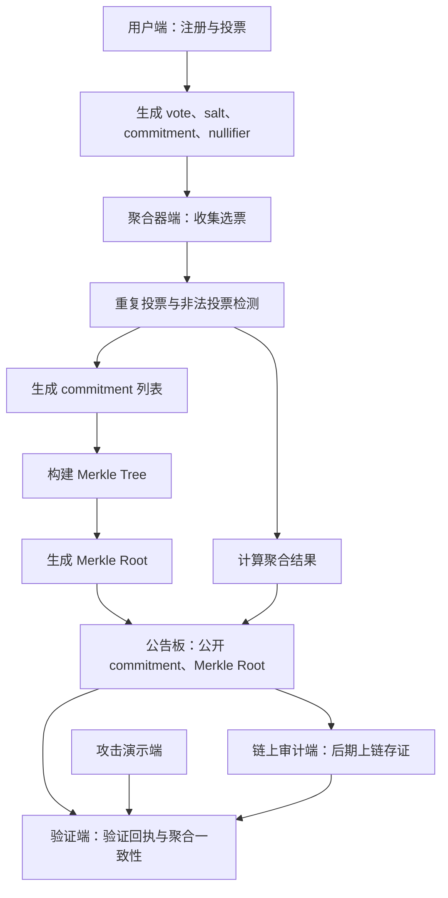

# VeriVote 架构设计

## 总体架构

VeriVote 采用分层、可审计、可演示的系统架构。核心思路是将“投票提交”“隐私保护”“聚合统计”“公开公告”“独立验证”“攻击演示”和“链上审计”拆分为相对独立的模块，方便 MVP 快速落地，也方便后续加入 Solidity 合约和零知识证明能力。

## 架构组件

### 用户端

用户端负责面向普通投票用户提供注册、投票和回执查看能力。

主要职责：

1. 用户注册或领取模拟身份。
2. 展示投票活动和候选项。
3. 用户选择候选项并提交投票。
4. 本地或服务端生成投票 commitment。
5. 返回投票回执，供用户后续验证。

关键输出：

1. vote。
2. salt。
3. commitment。
4. nullifier。
5. receipt。

### 管理员端

管理员端负责投票活动管理和审计态势查看。

主要职责：

1. 创建投票活动。
2. 配置候选项、投票时间和规则。
3. 启动、暂停或结束投票。
4. 查看投票数量、聚合状态和异常事件。
5. 触发聚合和公告发布流程。

管理员端不应直接修改已经公告的 commitment 集合。若需要修正，应生成可追踪的审计事件。

### 聚合器端

聚合器端是系统的核心处理组件，负责接收选票承诺、检测异常并生成可审计结果。

主要职责：

1. 收集用户提交的投票记录。
2. 检查投票格式是否合法。
3. 检查 nullifier 是否重复。
4. 过滤非法投票或标记异常投票。
5. 生成 commitment 列表。
6. 构建 Merkle 树并生成 Merkle Root。
7. 计算聚合统计结果。
8. 生成审计元数据和验证所需材料。

聚合器在 MVP 中可以是中心化组件。后续安全增强阶段应增加审计日志、输入签名和可复验聚合过程。

### 公告板

公告板是公开、只追加、可复验的数据展示和分发模块。

主要职责：

1. 公开合法投票 commitment 列表。
2. 公开 Merkle Root。
3. 公开聚合结果。
4. 公开总票数、候选项数量和投票活动状态。
5. 公开异常摘要和审计元数据。
6. 为验证端提供稳定的数据来源。

公告板不公开明文 vote 和 salt。用户可以用自己的回执验证 commitment 是否存在于公告板中，但不能反推出其他人的投票内容。

### 验证端

验证端用于独立验证公告板数据和用户回执的正确性。

主要职责：

1. 验证用户 receipt 中的 commitment 是否存在于 Merkle 树中。
2. 验证 Merkle proof 是否能还原公告板上的 Merkle Root。
3. 验证公告板总票数与 commitment 数量是否一致。
4. 验证聚合结果的票数总和是否与合法投票数量一致。
5. 检测重复 nullifier。
6. 展示异常原因和验证结论。

验证端是比赛演示中的关键模块，应能清晰展示“为什么验证通过”或“为什么验证失败”。

### 攻击演示端

攻击演示端用于模拟安全问题，帮助评委理解系统防护能力。

主要职责：

1. 模拟篡改 commitment。
2. 模拟重复投票。
3. 模拟非法候选项投票。
4. 模拟伪造聚合结果。
5. 模拟公告板数据缺失或 Merkle Root 不匹配。
6. 将攻击结果交给验证端验证并展示失败原因。

攻击演示端应与正常用户流程隔离，避免污染正式投票数据。MVP 中可以使用独立的演示数据集。

### 链上审计端

链上审计端是后期扩展模块，用于将关键审计摘要写入 Solidity 智能合约。

主要职责：

1. 将 Merkle Root 上链存证。
2. 将聚合结果摘要上链存证。
3. 记录投票活动状态变化。
4. 记录公告批次编号和时间戳。
5. 支持验证端读取链上数据，与公告板数据交叉验证。

链上审计端不负责存储明文投票，也不应直接存储大量 commitment。链上只保存关键摘要，完整数据仍由公告板提供。

## 数据流

## 核心验证关系

| 验证目标 | 验证材料 | 验证结论 |
| --- | --- | --- |
| 选票未被篡改 | receipt、commitment、Merkle proof、Merkle Root | 用户 commitment 被正确纳入公告板 |
| 未重复投票 | nullifier 列表、重复检测结果 | 同一身份未提交多张有效票 |
| 总票数一致 | commitment 数量、合法投票数量、聚合结果总和 | 公告板和聚合统计数量一致 |
| 结果未伪造 | 聚合结果、commitment 集合、审计元数据 | 聚合结果与公开数据匹配 |
| 链上未被替换 | 链上 Merkle Root、公告板 Merkle Root | 公告板摘要与链上存证一致 |

## MVP 技术选型建议

| 层级 | 建议 |
| --- | --- |
| 前端展示 | 后续可选择 React 或 Vue，仅在进入实现阶段创建 |
| 后端服务 | 后续可选择 Node.js、Python FastAPI 或 Java Spring Boot |
| 哈希算法 | SHA-256 或 Keccak-256 |
| 承诺构造 | commitment = Hash(vote, salt) 的简化方案 |
| Merkle Tree | 使用稳定、可复验的二叉 Merkle 树 |
| 链上合约 | 后期使用 Solidity 存储 root 和摘要 |
| ZK 原型 | 后期使用简化证明流程或教学型电路 |

当前阶段只定义架构，不创建前端、后端或合约代码。

## 设计原则

1. 隐私优先：公告板不公开明文投票。
2. 可验证优先：所有公开结果都应能被独立验证。
3. 演示友好：攻击场景要能直观看到失败原因。
4. 渐进增强：MVP 不追求一次性实现完整密码学系统。
5. 模块隔离：用户端、聚合器、公告板、验证端和攻击演示端边界清晰。
6. 链上最小化：链上只保存摘要，不保存敏感数据和大规模列表。

